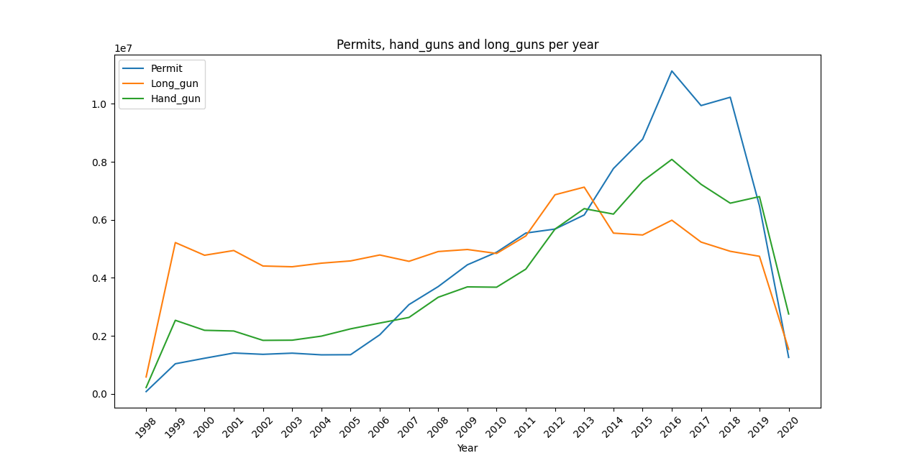

# Analysis of Firearm Usage Behavior in the United States Population

## Project description

We aim to study the firearm usage behavior across the United States population. We will utilize a dataset already included in the project folder, sourced from the following [link](https://www.kaggle.com/datasets/pedropereira94/nics-firearm-background-checks)

This dataset accumulates information (by date and state) regarding background checks for individuals applying for firearm permits. Our goal is to derive insights into state differences, temporal trends, and more.

- **permit:** Background check permits.
- **handgun:** Requests for handguns.
- **long_gun:** Requests for long guns.

These columns, along with month and state, are the focus of our analysis.

Additionally, we will incorporate population data to compute relative statistics. We will use the dataset also included in the project from this [link](https://gist.githubusercontent.com/bradoyler/0fd473541083cfa9ea6b5da57b08461c/raw/fa5f59ff1ce7ad9ff792e223b9ac05c564b7c0fe/us-state-populations.csv)

This dataset provides 2014 population data for different states of the United States and includes the following columns:

- **code:** Two-letter string identifying each state (e.g., CA for California, FL for Florida).
- **state:** Full name of the state.
- **pop_2014:** Population count in the year 2014.


## Dependencies
Ensure you have the necessary Python packages installed:
- pandas
- matplotlib
- [folium](https://python-graph-gallery.com/292-choropleth-map-with-folium/)
- selenium

Install them using the requirements file:

```bash
pip install -r requirements.txt
```
Now you can just activate the environment by:

```bash
activate usa_guns
```


## How to use the project
Once the environment is set up, just run the `main.py` script

```bash
python main.py
```




## Testing
To run the test, run the following command in the root directory

```bash
python -m unittest discover
```