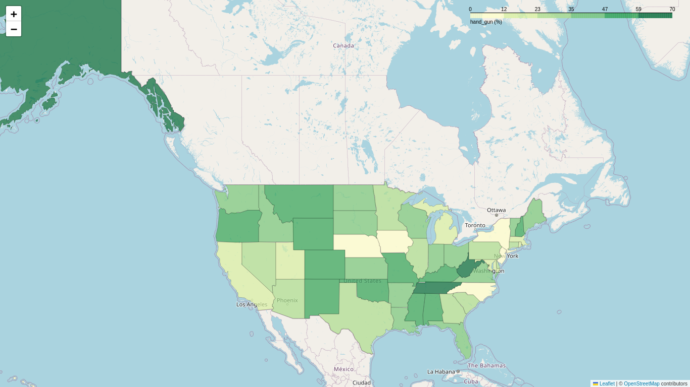

# Analysis of Firearm Usage Behavior in the United States Population

## Table of Content
1. [Project description](#project-description)
2. [Installation](#installation)
   - [Clone the Repository](#clone-the-repository)
   - [Set up Dependencies](#set-up-dependencies)
3. [How to Use the Project](#how-to-use-the-project)
4. [Testing](#testing)

---
## Project description

We aim to study the firearm usage behavior across the United States population. We will utilize a dataset already included in the project folder, sourced from the following [link](https://www.kaggle.com/datasets/pedropereira94/nics-firearm-background-checks)

This dataset accumulates information (by date and state) regarding background checks for individuals applying for firearm permits. Our goal is to derive insights into state differences, temporal trends, and more.

- **permit:** Background check permits.
- **handgun:** Requests for handguns.
- **long_gun:** Requests for long guns.

These columns, along with month and state, are the focus of our analysis.

Additionally, we will incorporate population data to compute relative statistics. We will use the dataset also included in the project from this [link](https://gist.githubusercontent.com/bradoyler/0fd473541083cfa9ea6b5da57b08461c/raw/fa5f59ff1ce7ad9ff792e223b9ac05c564b7c0fe/us-state-populations.csv)

This dataset provides 2014 population data for different states of the United States and includes the following columns:

- **code:** Two-letter string identifying each state (e.g., CA for California, FL for Florida).
- **state:** Full name of the state.
- **pop_2014:** Population count in the year 2014.

## Installation
To install the project:

### Clone the repository
First, clone the repository from GitHub to your local machine:

```
git clone https://github.com/AlexanderLB98/Analysis-of-Firearm-Usage-Behavior-in-the-United-States-Population.git
cd your_project
```


### Set up dependencies
It's a good practice to use a virtual environment to avoid dependency conflicts between different projects. I recommend using `pip` and `conda` for this, but you could also use `venv`. Ensure you have the necessary Python packages installed:
- pandas
- matplotlib
- [folium](https://python-graph-gallery.com/292-choropleth-map-with-folium/)
- selenium

Install them using the requirements file, but first create a new conda environment:


```bash
conda create --name usa_guns
```

```bash
pip install -r requirements.txt
```
Now you can just activate the environment by:

```bash
activate usa_guns
```


## How to use the project
Once the environment is set up, just run the `main.py` script

```bash
python main.py
```


*Figure 1: Yearly breakdown of data showcasing trends and patterns.*


*Figure 2: Percentage of permits issued by state, visualized on a map.*


*Figure 3: Percentage of handgun purchases by state, visualized on a map.*


*Figure 4: Percentage of long gun purchases by state, visualized on a map.*

## Testing
To run the test, run the following command in the root directory

```bash
python -m unittest discover
```

This will run al the unittests. if you want to run only one suite case, run

```bash
python tests/suitcase_test_dates.py 
```
from the CLI it will be asked for the test cases to be included in the test suite:
```
Select which suite you want to execute:
0. All
1. TestDates
2. TestFormatDate
Select: 
```

There are different test suites to test the different modules:
- suitcase_test_dates
- suitcase_test_common

Nevertheless, all these test are combined in one CLI program: `main_test.py`. Running this file will launch an interactive terminal asking for the specific suitcases to be launched. You can run this program from the root folder by typing:

```
python tests/main_test.py 
```

This will ask for the specific suite to test:

```
"Select which suite(s) you want to execute:"
0. All suite cases
1. Common suite Tests
2. Date suite Tests
```

If you type `0`, all the tests will be launched automatically. If `1` or `2` is selected, you will get to the previous test cases defined above.